# Screenshots

A tour of every SpecQuill surface, captured from the demo fixture
(`trading-specs`). The images are regenerated semi-automatically:
`make shots` boots an isolated server against the fixtures (with the
deterministic mock LLM standing in for the AI) and re-takes every shot via
Playwright — see `scripts/shots.sh` and `web/e2e/screenshot.spec.ts`.

## Overview

The project dashboard: what needs review, merge-ready workspaces, and the
compact alignment/links summaries.

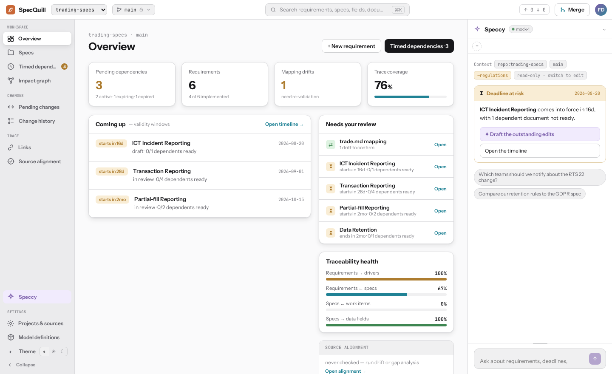

## Editor

Markdown documents with typed frontmatter, edited as rich text. Saves are
uncommitted worktree drafts; explicit Commit turns them into history.

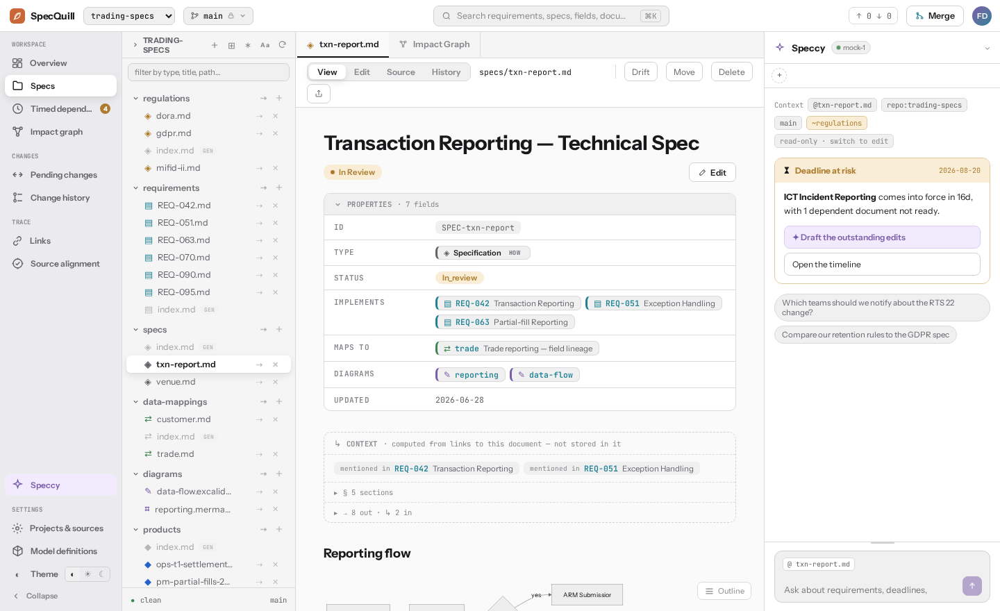

## Speccy — the AI copilot

Chat grounded on the workspace and its read-only reference sources; answers
can be turned into draft edits and opened as a diff.

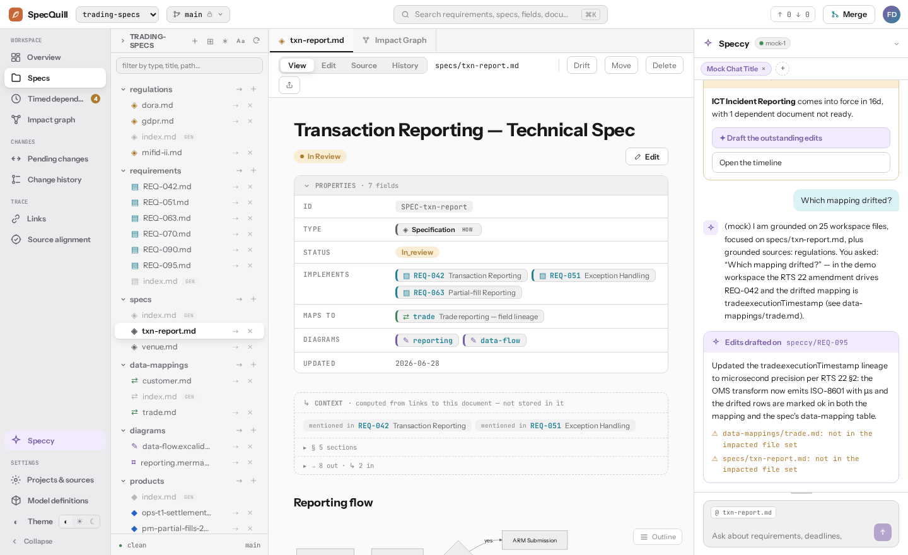

## Source alignment

Drift and gap runs verify workspace documents against reference sources;
findings carry verbatim evidence and can be filed, drafted, planned, or
dismissed. Every run keeps a live, git-native report document.

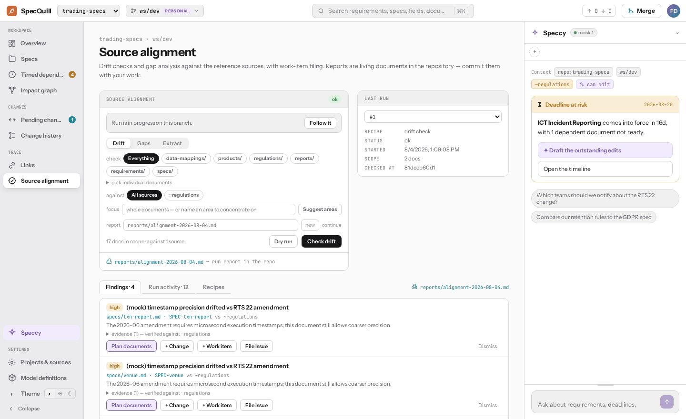

## Impact graph

The frontmatter link graph around one document's chain — drivers, delivers,
mappings — as a pan/zoom canvas.

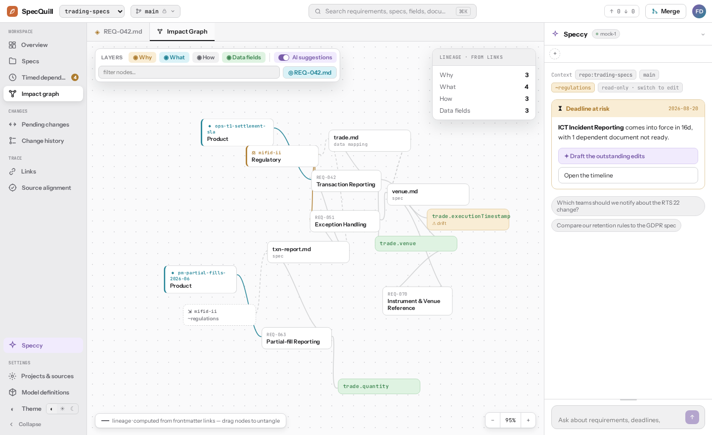

## Model definitions

The workspace's own document families, axes, and link types — the schema the
linker, drift actions, and editors all obey.

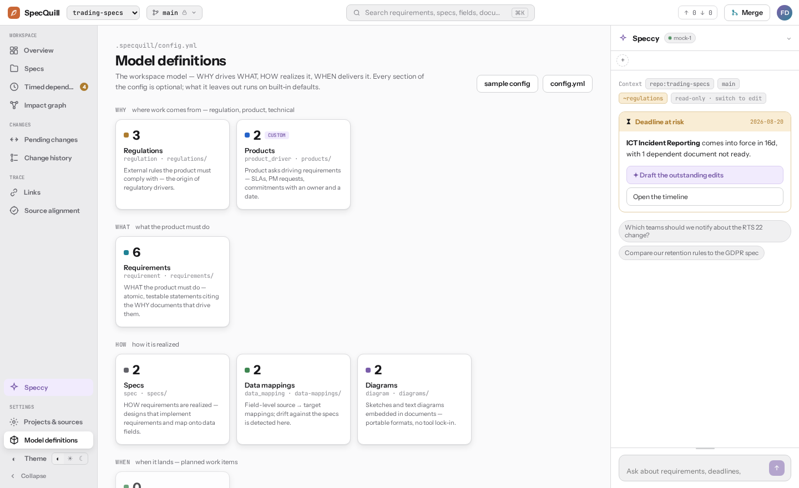

## Links

AI-proposed missing typed links (validated server-side) plus the on-demand
link check.

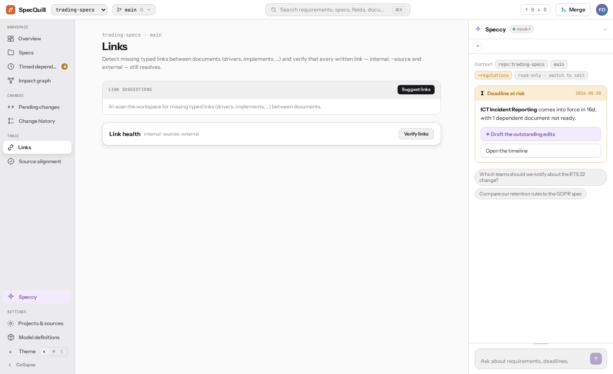

## Timed dependencies

Documents with validity windows (`starts`/`ends`, `due`, …) as
pending / active / expiring / expired, with their dependents' readiness.

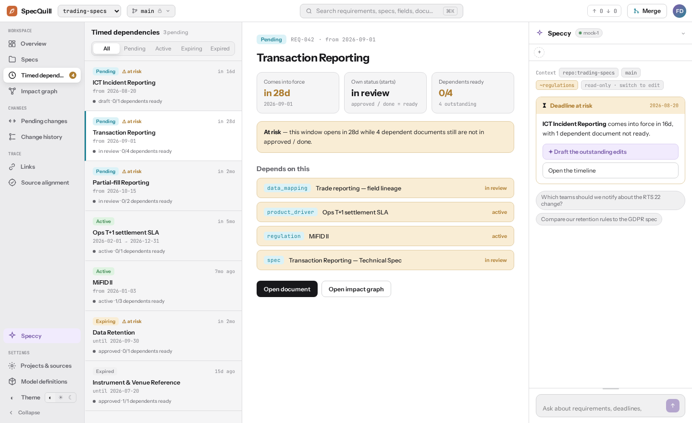

## Pending changes

Uncommitted worktree edits, commits ahead of the default branch, and the
branch's open MR/PR in one place.

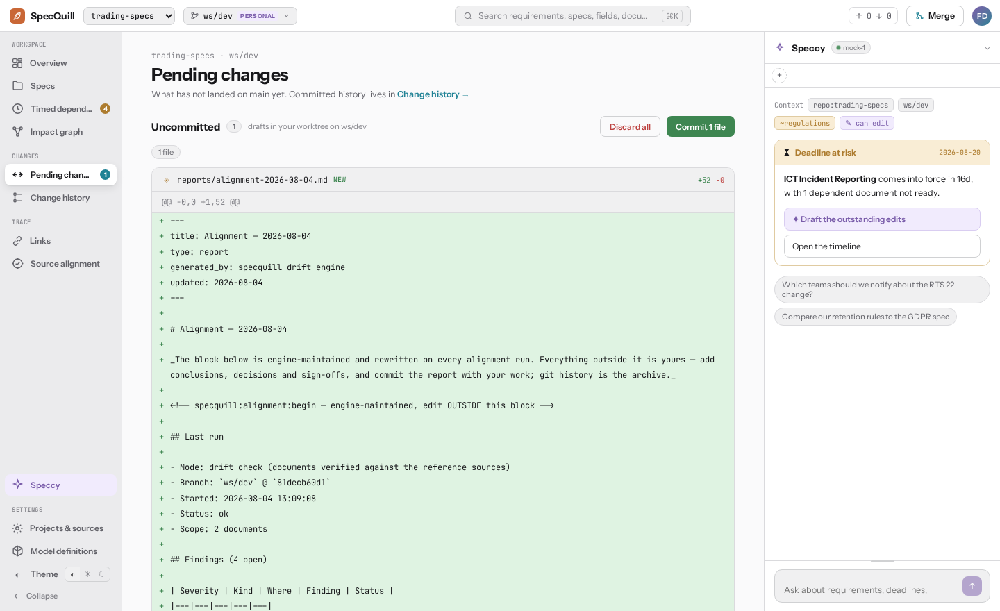

## Change history

Committed history from git, with semantic per-document deltas and AI commit
summaries.

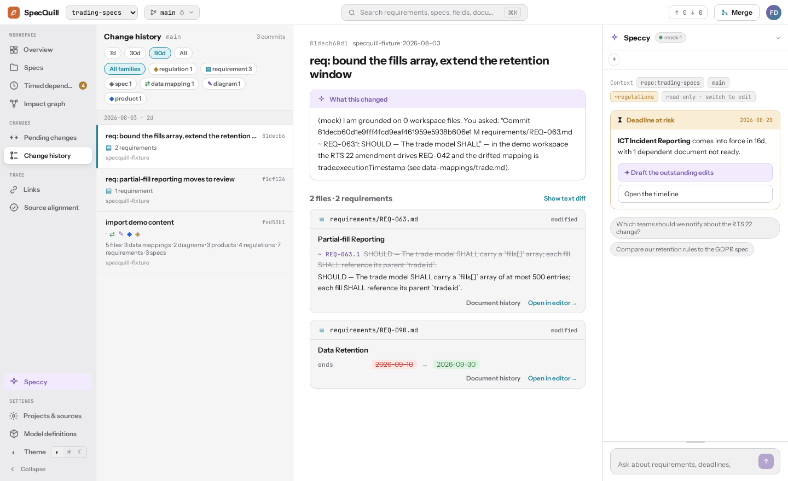

## Sketches

Excalidraw sketches stored as plain PNGs with the scene embedded — viewable
anywhere, editable in place.

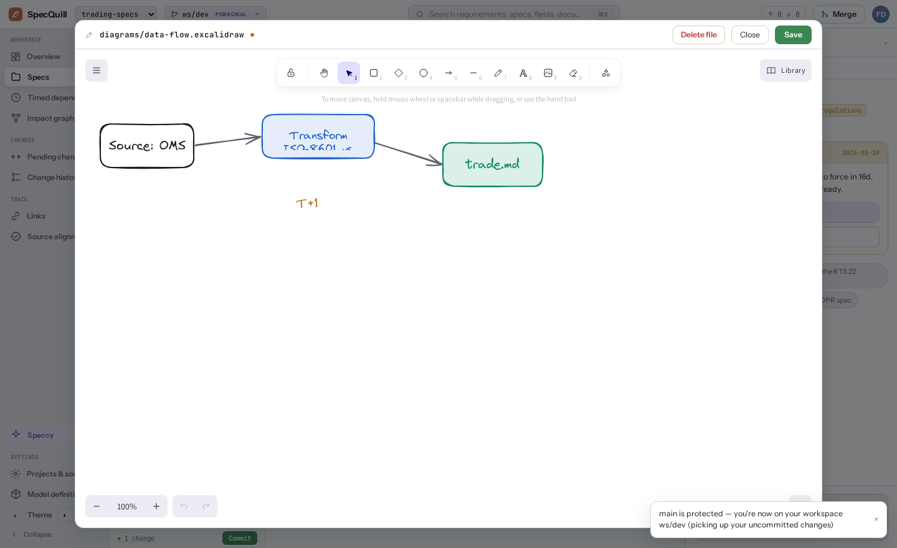

## Administration

Sources, sync status, and per-repo access.

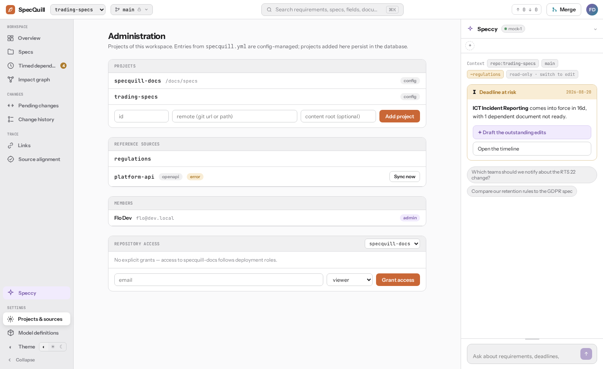
