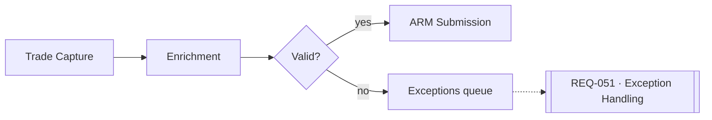

# Transaction Reporting — Technical Spec

## Reporting flow

## Timing & precision
- Execution timestamp recorded to the **microsecond** (RTS 22 §2, 2026-06).
- Applies to mapping `trade.executionTimestamp`.

## Data mapping

| Source field  | Target field             | Transform   | Status  |
|---------------|--------------------------|-------------|---------|
| oms.exec_time | trade.executionTimestamp | ISO-8601 μs | ⚠ drift |
| oms.venue_mic | trade.venue              | MIC lookup  | ✓ ok    |
| acct.lei_code | account.lei              | passthrough | ✓ ok    |

Full lineage → [data-mappings/trade.md](../data-mappings/trade.md).

## Source-to-target sketch

<!-- embed: excalidraw -->

